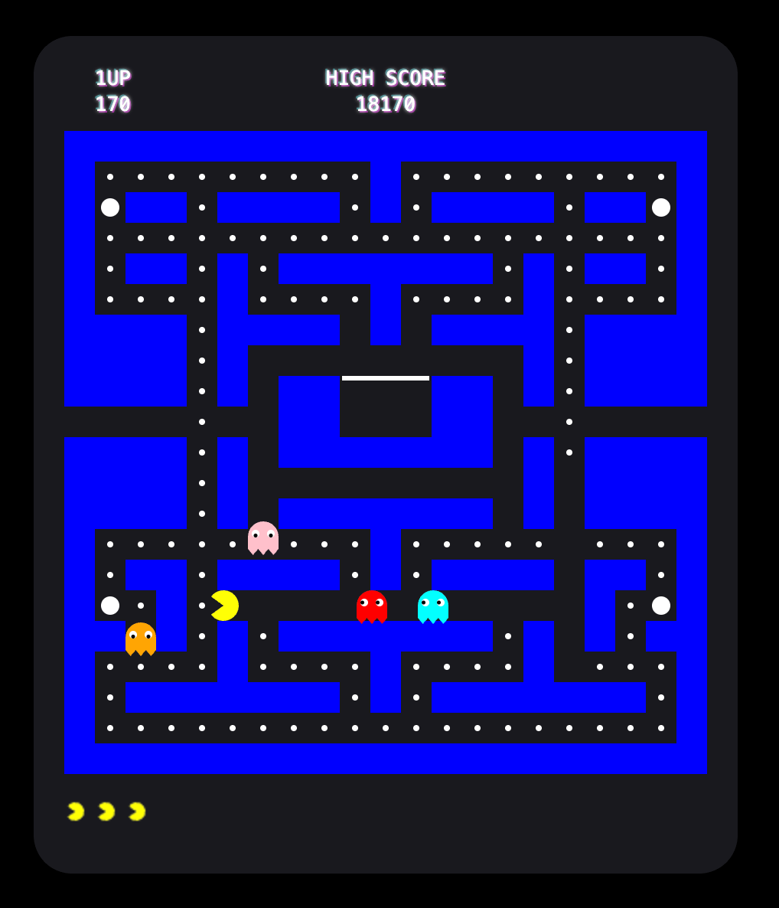

# Pac-Man Game
Demo: https://jamesalmeida.github.io/pacman/

## Description

Pac-Man clone that runs in the browser. Wanted to see how far I can take it with everything in just a single HTML file. Uses HTML, CSS, Javascript. No libraries. 

## Setup and Installation

No special setup is required.

## How to Run

1.  Clone this repository or download the `pacman.html` file.
2.  Open the `pacman.html` file in your web browser.

## Controls

- Arrow keys or WASD to move Pac-Man
- Press '1' to start a new game when game over
- Press 'M' to toggle background music on/off
